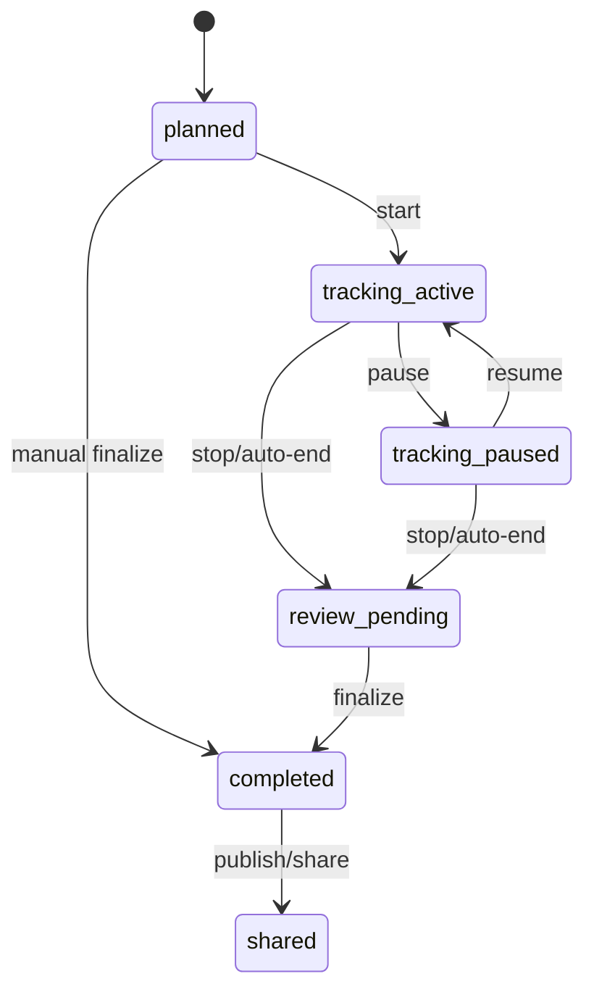
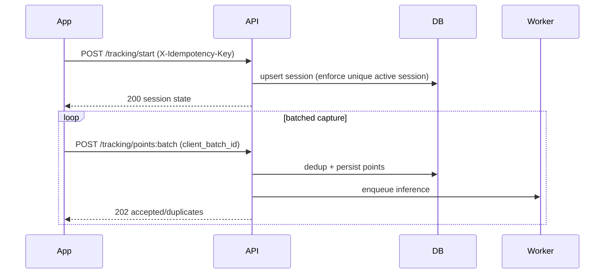
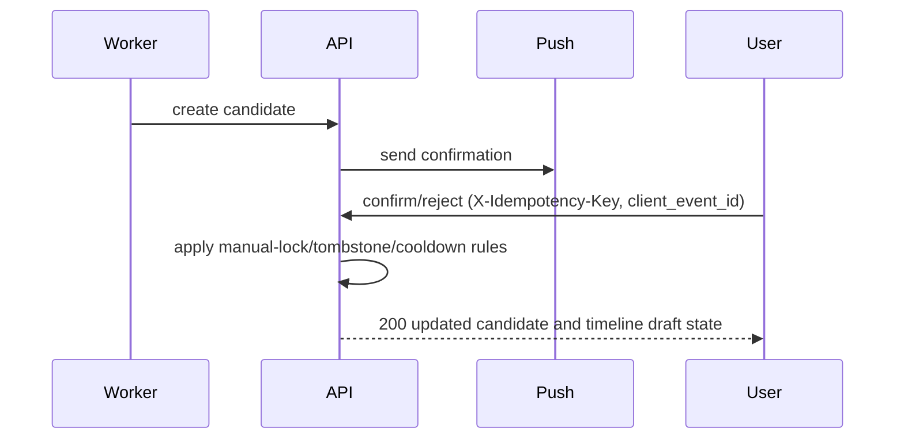

# Live Tracking Phase 0 Contract Freeze (2026-03-21)

Date: 2026-03-21  
Owner: Codex  
Status: Accepted Working Baseline (Phase 0 Validated)

## 1) Source Documents Reviewed

1. `docs/live-tracking/live-tracking-prd.md`
2. `docs/live-tracking/live-tracking-execution-plan.md`
3. `flutter/docs/handoffs/2026-03-20-trip-sync-m0-contract-freeze.md`
4. `flutter/docs/handoffs/2026-03-20-trip-sync-execution-tracker.md`
5. `backend/README.md`
6. `flutter/README.md`

## 2) Contract Scope

This freeze defines the implementation contract required before backend/Flutter coding starts for live tracking:

1. lifecycle state machines
2. API surface and idempotency wire format
3. DB invariants and dedup constraints
4. manual-lock and tombstone behavior
5. legacy status migration/backfill mapping
6. background capture runtime contract
7. rollout gates for canary decisions

## 3) Contract-First Rules (Mandatory)

1. Backend OpenAPI remains source of truth; Flutter consumes generated `packages/dora_api` types.
2. Generated files are never hand-edited: `flutter/packages/dora_api/**`, `*.g.dart`, `*.freezed.dart`, Drift-generated outputs.
3. Mutating live-tracking endpoints require idempotency support and deterministic replay semantics.
4. Manual edits always win over auto inference.
5. Tombstones and cooldowns are enforced before candidate/place/route regeneration.
6. One active tracking session per trip per user is guaranteed by DB constraint, not app logic alone.

## 4) Lifecycle State Machines (Frozen)

## 4.1 Trip Status Vocabulary

1. `planned`
2. `tracking_active`
3. `tracking_paused`
4. `review_pending`
5. `completed`
6. `shared`

## 4.2 Tracking Session Vocabulary

1. `active`
2. `paused`
3. `ended`
4. `abandoned`

## 4.3 Allowed Transitions

Trip status:

1. `planned -> tracking_active` (start)
2. `tracking_active -> tracking_paused` (pause)
3. `tracking_paused -> tracking_active` (resume)
4. `tracking_active|tracking_paused -> review_pending` (stop/auto-end with draft)
5. `review_pending -> completed` (user finalize)
6. `planned -> completed` (manual-only finalize when tracking was never started)
7. `completed -> shared` (visibility/share action)

Session state:

1. `active -> paused` (pause)
2. `paused -> active` (resume)
3. `active|paused -> ended` (stop/auto-end)
4. `active|paused -> abandoned` (reconciliation timeout + unrecoverable interruption)

Disallowed:

1. direct `ended -> active`
2. parallel `active` sessions for same `(trip_id, user_id)`
3. direct `planned -> shared` (must pass through `completed`)

## 4.4 State Transition Diagram



## 5) API Contract (Frozen)

All endpoints under `/api/v1`.  
Auth: bearer token required for all mutating calls.

## 5.1 Idempotency Header Contract

1. Header: `X-Idempotency-Key` (UUID v4 string).
2. Required on all mutating live-tracking endpoints listed below.
3. Scope uniqueness: `(user_id, endpoint_signature, idempotency_key)`.
4. Replayed request with same payload returns original response body and status.
5. Replayed request with different payload returns `409 idempotency_conflict`.
6. Response header: `Idempotency-Replayed: true|false`.
7. Retention target: 72 hours minimum.

## 5.2 Endpoint Matrix

1. `POST /trips/{trip_id}/tracking/start`
   - idempotent: yes
   - body: `client_session_id`, `started_at`, `timezone`, `device_context`
   - success: `200` (returns existing active session or newly started one)
2. `POST /trips/{trip_id}/tracking/pause`
   - idempotent: yes
   - body: `client_event_id`, `paused_at`, `reason`
   - success: `200`
3. `POST /trips/{trip_id}/tracking/resume`
   - idempotent: yes
   - body: `client_event_id`, `resumed_at`
   - success: `200`
4. `POST /trips/{trip_id}/tracking/stop`
   - idempotent: yes
   - body: `client_event_id`, `stopped_at`, `reason`
   - success: `200`
5. `POST /trips/{trip_id}/tracking/points:batch`
   - idempotent: yes
   - body required: `session_id`, `client_batch_id`, `sent_at`, `points[]`
   - per-point required: `point_id`, `recorded_at`, `latitude`, `longitude`, `accuracy_m`
   - success: `202` (accepted for async inference pipeline)
6. `GET /trips/{trip_id}/checkins/pending`
   - idempotent: n/a (read)
   - success: `200`
7. `POST /checkins/{candidate_id}/confirm`
   - idempotent: yes
   - body required: `client_event_id`, `confirmed_at`
   - optional: `place_override`
   - success: `200`
8. `POST /checkins/{candidate_id}/reject`
   - idempotent: yes
   - body required: `client_event_id`, `rejected_at`, `reason`
   - success: `200`
9. `POST /checkins/{candidate_id}/snooze`
   - idempotent: yes
   - body required: `client_event_id`, `snoozed_until`
   - success: `200`
10. `POST /trips/{trip_id}/moments`
   - idempotent: yes
   - body required: `client_event_id`, `captured_at`
   - optional: `note`, `location`, `media_refs`
   - success: `201`
11. `PATCH /moments/{moment_id}`
   - idempotent: yes
   - body: partial update (`note`, `linked_place_id`, `captured_at`, etc.)
   - success: `200`
12. `POST /trips/{trip_id}/auto-finalize/preview`
   - idempotent: yes
   - body optional: `preview_context`
   - success: `200`
13. `POST /trips/{trip_id}/auto-finalize/commit`
   - idempotent: yes
   - body required: `client_event_id`, `committed_at`
   - success: `200`
14. `POST /devices/push-token/register`
   - idempotent: yes
   - body required: `token`, `platform`, `app_version`
   - success: `200`
15. `DELETE /devices/push-token/{token}`
   - idempotent: yes
   - body: empty
   - success: `204`

## 5.3 Points Batch Response Contract

`202 Accepted` response body:

```json
{
  "trip_id": "uuid",
  "session_id": "uuid",
  "client_batch_id": "uuid",
  "accepted_points": 97,
  "duplicate_points": 3,
  "ingest_job_id": "uuid",
  "idempotency_replayed": false
}
```

## 5.4 Standard Error Contract

1. `400` invalid payload/format
2. `401` unauthenticated
3. `403` ownership/permission denied
4. `404` trip/session/candidate/moment not found
5. `409` state conflict or idempotency conflict
6. `422` semantic validation failure
7. `429` throttled
8. `5xx` server/worker downstream failure

Error payload baseline:

```json
{
  "error_code": "idempotency_conflict",
  "message": "X-Idempotency-Key was reused with a different payload.",
  "request_id": "uuid"
}
```

## 6) DB Invariants and Constraint Matrix (Frozen)

## 6.1 Session and Point Invariants

1. `trip_tracking_sessions`: partial unique index on `(trip_id, user_id)` where `state='active'`.
2. `trip_location_points`: unique `(session_id, point_id)` (canonical DB dedup invariant).
3. `trip_location_points`: batch replay protection is service/idempotency enforced via `client_batch_id`; no second DB unique index is required in v1.
4. `trip_checkin_candidates`: dedup fingerprint index to avoid immediate duplicate candidates.
5. `api_idempotency_records`: unique `(user_id, endpoint_signature, idempotency_key)`.

## 6.2 Manual-Lock and Tombstone Representation

Manual-lock semantics:

1. `trip_places.locked_fields` JSONB default `{}`.
2. `routes.locked_fields` JSONB default `{}`.
3. If a field key exists in `locked_fields`, auto pipelines cannot overwrite it.

Tombstone semantics:

1. New table `trip_auto_entity_tombstones` with:
   - `trip_id`, `user_id`, `entity_type`, `entity_fingerprint`
   - `deleted_entity_id` (nullable)
   - `cooldown_expires_at`
   - `created_at`, `reason`
2. Unique index on `(trip_id, user_id, entity_type, entity_fingerprint)`.
3. Auto candidate/composer jobs must check active tombstones before generating entities.

## 6.3 Suggested Index DDL (Reference)

```sql
CREATE UNIQUE INDEX uq_tracking_session_active_trip_user
ON trip_tracking_sessions (trip_id, user_id)
WHERE state = 'active';

CREATE UNIQUE INDEX uq_tracking_point_session_point
ON trip_location_points (session_id, point_id);

CREATE UNIQUE INDEX uq_idempotency_user_endpoint_key
ON api_idempotency_records (user_id, endpoint_signature, idempotency_key);

CREATE UNIQUE INDEX uq_tombstone_trip_user_type_fp
ON trip_auto_entity_tombstones (trip_id, user_id, entity_type, entity_fingerprint);
```

## 7) Conflict Resolution Contract (Frozen)

1. Manual field edits lock that field; auto pipeline may append but cannot silently overwrite locked values.
2. Rejecting a candidate sets cooldown; same candidate fingerprint cannot be recreated during cooldown.
3. Cooldown is a service-enforced temporal invariant and must be validated before candidate creation/recreation.
4. Candidate partial unique index on `status IN ('pending', 'snoozed')` prevents concurrent active duplicates but does not replace cooldown checks.
5. Deleting auto place/route writes tombstone and prevents immediate regeneration.
6. If user edits auto-generated entity manually, `source` moves to `edited_auto`.

## 8) Legacy Status Migration and Backfill Contract (Frozen)

Backend trips:

1. Existing rows with no `status` get `planned` on migration.
2. New default `status` is `planned`.

Flutter local mapping (legacy `user_trips.status`):

1. `editing` + active session -> `tracking_active`
2. `editing` + latest paused session -> `tracking_paused`
3. `editing` + no session -> `planned`
4. `completed` -> `completed`
5. `shared` -> `shared`

Compatibility:

1. Mixed app versions must keep `editing` readable while new statuses are introduced.
2. Server-to-client mapping must preserve legacy UI paths until rollout completion.

## 9) Background Runtime Contract (Frozen)

1. Continuous tracking requires a dedicated location runtime path; `workmanager` is recovery/flush only.
2. Android contract:
   - foreground service notification during active capture
   - background location permission flow gated by explicit user consent
3. iOS contract:
   - `NSLocationAlwaysAndWhenInUseUsageDescription` + background location mode
   - background updates capability enabled for active sessions
4. Resume/reconciliation contract:
   - app restart must reconcile active session and resume upload queue without duplicate session creation.

## 10) Sequence Contract

## 10.1 Start and Capture



## 10.2 Candidate Confirmation



## 11) Numeric Rollout Gates (Frozen Baseline)

1. Points ingest API p95 < 500 ms.
2. Successful point-batch ingest rate >= 99.0%.
3. Duplicate active-session incidents = 0.
4. Stuck-active sessions after grace window < 0.5%.
5. Candidate pipeline success (create -> notify -> action persist) >= 98.0%.
6. Crash-free active tracking sessions >= 99.5%.
7. Queue backlog recovers to steady-state within 15 minutes after network restoration tests.
8. Rollback drill completes without data corruption or orphan active sessions.

## 12) Resolved Product Decisions (Locked for Phase 1)

1. Tracking mode (`v1`):
   - full foreground + background support on Android and iOS where permission is granted
   - fallback to foreground-only behavior when background permission is denied
2. Sampling cadence and adaptive thresholds:
   - base interval: 10s
   - moving fast (>= 8 m/s): 5s
   - walking range (1-8 m/s): 10s
   - stationary (< 1 m/s for >= 120s): 60s
   - batch flush trigger: every 30s or every 25 points (whichever comes first)
3. Auto-end thresholds:
   - inactivity threshold: 6 hours without meaningful movement
   - meaningful movement baseline: >= 250m displacement within rolling 30-minute window
   - user prompt grace before auto-end commit: 30 minutes
4. Candidate notification strategy:
   - app foreground: in-app prompt/inbox first
   - app background/terminated: push notification + inbox entry
   - canonical queue of pending actions remains `/checkins/pending`
5. Moment suggestion strictness:
   - `conservative` default for v1
   - auto-link only when distance <= 150m and time delta <= 30 minutes to nearest confirmed or high-confidence inferred place
   - otherwise keep moment unlinked for manual attachment
6. Retention policy and overrides:
   - default raw-point retention remains 90 days
   - retention is deployment-configurable by region/environment (supported presets: 30/60/90 days)
   - no hardcoded geofence-based retention logic in v1 app client
7. Rollout strategy:
   - internal parity dogfood on Android + iOS
   - external canary progresses Android-first
   - iOS external expansion starts only after Android canary gates stay green for 7 consecutive days

## 13) Exit Checklist for Phase 0 -> Phase 1

1. API shapes and idempotency keys accepted.
2. DB invariants and index strategy accepted.
3. Manual-lock/tombstone representation accepted.
4. Migration/backfill mapping accepted.
5. Background runtime contract accepted.
6. Rollout numeric gates accepted.
7. Phase 2 test plan explicitly covers cooldown enforcement and manual-only completion path.
8. Product decisions in section 12 accepted as implementation defaults.

If all eight are accepted, Phase 1 implementation can start.
