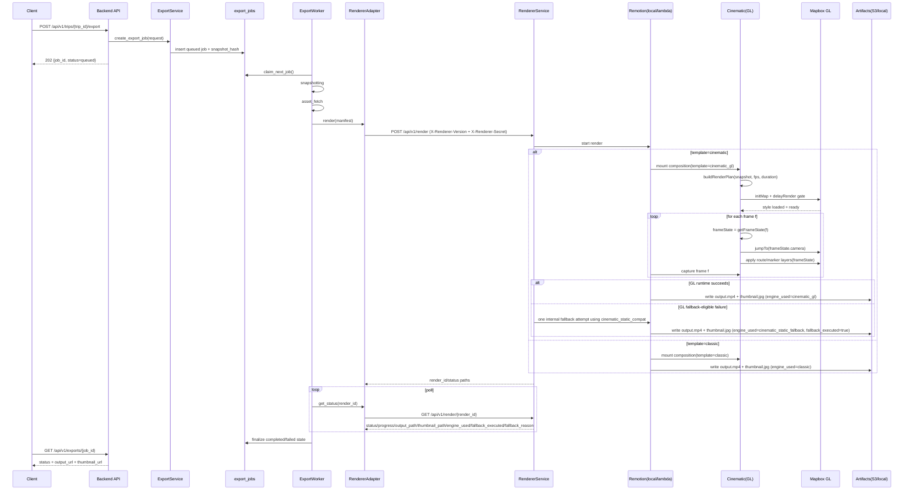
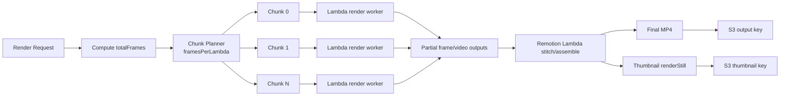
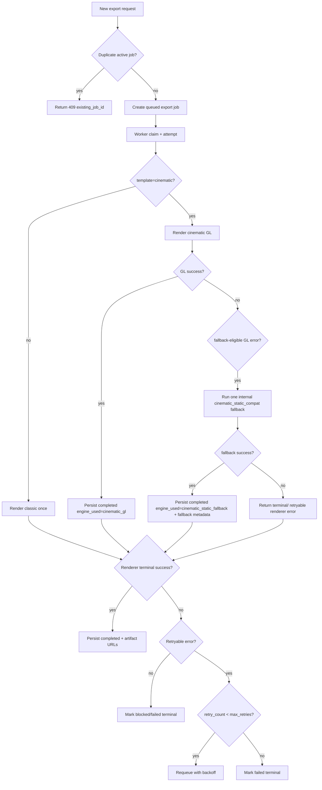
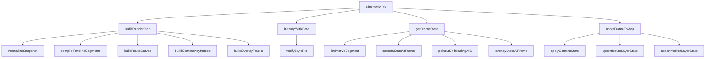

# Cinematic GL Runtime Architecture (Canonical)

Status: Canonical source of truth  
Date: 2026-03-24  
Owner: Renderer + Backend Worker  
Scope: `template=cinematic` end-to-end runtime flow  

## 1. Canonical Rule

If any other doc conflicts with this file, this file wins.

Referenced docs (non-canonical for runtime flow):
1. `video-renderer/docs/prd-cinematic-gl-remotion-lambda.md`
2. `video-renderer/docs/implementation-spec-cinematic-gl-quality.md`
3. `video-renderer/docs/renderer-api-contract-v2-draft.md`
4. `video-renderer/docs/2026-03-24-cinematic-gl-execution-tracker.md`

---

## 2. System Diagram (Input to Output)

```mermaid
flowchart LR
  A[Flutter / Client\nPOST /api/v1/trips/:trip_id/export] --> B[Backend API\nexports.py]
  B --> C[ExportService\ncreate_export_job]
  C --> D[(Postgres export_jobs)]
  D --> E[Export Worker Loop\nclaim_next_job]
  E --> F[Worker Stages\nsnapshotting -> asset_fetch -> rendering -> encoding -> uploading -> finalizing]
  F --> G[Renderer Adapter\nexport_renderer.py]
  G --> H[Renderer Service\nPOST /api/v1/render]
  H --> I{RENDER_BACKEND}
  I -->|local| J[@remotion/renderer\nrenderMedia/renderStill]
  I -->|lambda| K[@remotion/lambda/client\nrenderMediaOnLambda/renderStillOnLambda]
  J --> L[Cinematic Composition\n(template=cinematic)]
  K --> L
  L --> M{Cinematic engine path}
  M -->|primary| N[GL Runtime\nMapbox GL + frameState(f)]
  M -->|fallback (one attempt)| O[Static Compatibility Runtime]
  N --> P[Rendered frames]
  O --> P
  P --> Q[Encoded MP4 + thumbnail]
  Q --> R[(S3 or local artifact path)]
  R --> S[Worker polls renderer status]
  S --> D
  D --> T[GET /api/v1/exports/:job_id]
  T --> A
```

---

## 3. Sequence Diagram (Exact Runtime Order)



---

## 4. Frame Engine Diagram (How each frame is produced)

```mermaid
flowchart TD
  S[Snapshot JSON] --> N1[normalizeSnapshot]
  N1 --> T1[compileTimelineSegments]
  T1 --> R1[buildRouteCurves]
  T1 --> C1[buildCameraKeyframes]
  T1 --> O1[buildOverlayTracks]
  R1 --> P1[buildRenderPlan]
  C1 --> P1
  O1 --> P1
  P1 --> F1[getFrameState(f)]
  F1 --> M1[map.jumpTo(center,zoom,bearing,pitch)]
  F1 --> L1[updateRouteLayer(draw_progress)]
  F1 --> K1[updateMarkerLayer(position,heading)]
  F1 --> O2[renderOverlays(label/cards)]
  M1 --> CAP[Remotion captures frame f]
  L1 --> CAP
  K1 --> CAP
  O2 --> CAP
```

---

## 5. Lambda Chunking and Stitching



Rules:
1. Chunk boundaries must not change frame logic.
2. `frameState(f)` is pure and independent from previous chunk state.
3. Seam continuity checks compare last frame of chunk `i` and first frame of chunk `i+1`.

---

## 6. Module and Function Interaction Matrix

## 6.1 Existing control-plane modules

1. `backend/app/api/v1/exports.py`
   - `create_export()`
   - `get_export_status()`
   - `cancel_export()`
2. `backend/app/services/export_service.py`
   - `create_export_job()`
   - `_build_snapshot()`
   - `_compute_snapshot_hash()`
   - `_find_duplicate_job()`
3. `backend/app/workers/export_worker.py`
   - `claim_next_job()`
   - `run_job_once()`
   - `_mark_retry_or_fail()`
   - `_mark_terminal_blocked()`
4. `backend/app/services/export_renderer.py`
   - `LocalRemotionRenderer.render()`
   - `LocalRemotionRenderer.get_status()`
   - `LocalRemotionRenderer.cancel()`
5. `video-renderer/src/server.js`
   - `validateManifest()`
   - `submitRender()`
   - `runLocalRender()`
   - `getRenderStatus()`
6. `video-renderer/src/lambda-renderer.js`
   - `submit()`
   - `getStatus()`
   - `cancel()`

## 6.2 Canonical cinematic GL runtime modules (target)

1. `src/remotion/gl/normalize-snapshot.js`
   - `normalizeSnapshot(snapshot)`
2. `src/remotion/gl/timeline-compiler.js`
   - `compileTimelineSegments(input)`
3. `src/remotion/gl/route-animator.js`
   - `buildRouteCurves(segments)`
   - `pointAtS(curve, s)`
   - `headingAtS(curve, s, eps)`
4. `src/remotion/gl/camera-planner.js`
   - `buildCameraKeyframes(segments, routeData)`
   - `interpolateCamera(frame, keyframes)`
5. `src/remotion/gl/overlay-planner.js`
   - `buildOverlayTracks(segments)`
   - `resolveCardPlacement(anchor, cardSize, viewport, routePolyline)`
6. `src/remotion/gl/render-plan-builder.js`
   - `buildRenderPlan(snapshot, config)`
   - `getFrameState(plan, frame)`
7. `src/remotion/gl/map-init.js`
   - `initMapWithGate(config)` (delayRender/continueRender contract)
8. `src/remotion/gl/map-runtime.js`
   - `applyFrameToMap(map, frameState)`
9. `src/remotion/Cinematic.jsx`
   - `Cinematic({snapshot})`
   - calls `buildRenderPlan()`, `getFrameState()`, `applyFrameToMap()`

---

## 7. Animation and Processing Logic

Per-frame order:
1. `frame = useCurrentFrame()`
2. `frameState = getFrameState(plan, frame)`
3. `jumpTo(frameState.camera)`
4. route layer update
5. marker layer update
6. overlay render
7. capture frame

Easing definitions:
1. `easeInOutSine(p) = 0.5 * (1 - cos(pi * p))`
2. `easeOutCubic(p) = 1 - (1 - p)^3`
3. `easeOutQuad(p) = 1 - (1 - p)^2`

Interpolation rules:
1. shortest-path lon interpolation across antimeridian
2. shortest-angle bearing interpolation
3. clamp zoom/pitch/bearing bounds

---

## 8. GL Usage Contract

1. GL is only used for `template=cinematic`.
2. Map init blocks rendering until style-ready gate passes.
3. Style pin (`style_revision` or `style_hash`) is required for cinematic.
4. Mismatch -> terminal error `map_style_revision_mismatch`.
5. No real-time/clock-driven camera animations.

---

## 9. Remotion Responsibilities

Local backend:
1. `renderMedia()` produces MP4.
2. `renderStill()` produces thumbnail.

Lambda backend:
1. `renderMediaOnLambda()` orchestrates chunk renders and stitching.
2. `renderStillOnLambda()` produces thumbnail artifact.
3. Output keys are persisted and polled via renderer status endpoint.

---

## 10. AWS and Lambda Responsibilities

1. Lambda executes Remotion render workers.
2. S3 stores final video and thumbnail artifacts.
3. CloudWatch tracks Invocations/Errors/Throttles/Duration/Concurrency.
4. Worker polls renderer status until terminal state.

Resource naming convention:
1. `dora-render-{env}-fn-main`
2. `dora-render-{env}-site`
3. `dora-render-{env}-output`
4. `dora-render-{env}-dashboard`

---

## 11. Retry, Dedup, and Failure Decision Tree



Rules:
1. Source-of-truth attempts: `export_jobs.retry_count`.
2. Lambda internal chunk retries do not increment job attempt count.
3. GL->static fallback happens inside one worker attempt and does not increment `retry_count` when fallback succeeds.
4. `fallback_executed` is true only when static fallback path actually ran.
5. Dedup fingerprint uses snapshot+render config fields.

## 11.1 Retry policy ownership (cross-language)

1. Backend worker retry decisions are authoritative and implemented in Python (`backend/app/workers/export_worker.py`).
2. Renderer-side `src/remotion/gl/retry-policy.js` is a renderer classification helper, not the global attempt source-of-truth.
3. A shared retry-code matrix must be maintained in docs/fixtures and validated by both Python worker tests and renderer tests to prevent drift.

---

## 12. Output Contract

Renderer status payload (`GET /api/v1/render/{render_id}`) must include:
1. `engine_used` (always non-null)
2. `fallback_executed` (always boolean)
3. `fallback_reason` (nullable; required when `fallback_executed=true`)

Final completed export must have:
1. `output_url` or `output_path` non-null
2. `thumbnail_url` or `thumbnail_path` non-null
3. terminal status `completed`
4. recorded duration and timestamps
5. `engine_used` in (`cinematic_gl|cinematic_static_fallback|classic`)
6. `fallback_executed` and `fallback_reason` satisfying fallback rules above

---

## 13. Change Control

Any runtime-flow change must update this doc first:
1. API path changes
2. function ownership changes
3. frame pipeline changes
4. retry/dedup semantics
5. lambda stitching strategy

---

## 14. Utility Function Catalog (Exact Exports)

Rule:
1. Export names and signatures below are canonical implementation targets for phases P1-P3.
2. If implementation feedback requires signature changes, update this section and related tests in the same change before merge.

Notes:
1. Signatures are shown in TypeScript style for clarity.
2. Runtime files remain JavaScript/JSX unless project later migrates.

## 14.1 `src/remotion/gl/types.js` (shared shape helpers)

Exports:
1. `isLngLat(value: unknown): boolean`
2. `isFrameIndex(value: unknown): boolean`
3. `isNormalized(value: unknown): boolean`

Used by:
1. all planner modules for runtime guards.

## 14.2 `src/remotion/gl/quality-constants.js`

Exports:
1. `CAMERA_LIMITS: { minZoom: number; maxZoom: number; minPitch: number; maxPitch: number; maxBearingDeltaPerFrame: number }`
2. `EASING: { camera: "easeInOutSine"; route: "easeOutCubic"; marker: "easeInOutSine"; label: "easeOutQuad"; opacity: "easeInOutSine" }`
3. `SEAM_THRESHOLDS: { maxCameraJumpDeg: number; maxMarkerJumpPx1080: number }`
4. `OVERLAY_SAFE_AREA: { leftPct: number; rightPct: number; topPct: number; bottomPct: number }`
5. `ROUTE_STYLE_DEFAULTS: { strokeWidth: number; glowWidth: number }`

Used by:
1. camera planner
2. overlay planner
3. seam regression tests

## 14.3 `src/remotion/gl/normalize-snapshot.js`

Exports:
1. `normalizeSnapshot(snapshot: unknown): NormalizedSnapshot`
2. `extractRendererConfig(snapshot: NormalizedSnapshot): RendererConfig`
3. `validateSnapshotForCinematic(snapshot: NormalizedSnapshot): void`

Used by:
1. `buildRenderPlan()`
2. renderer manifest validation alignment checks

## 14.4 `src/remotion/gl/timeline-compiler.js`

Exports:
1. `compileTimelineSegments(input: { places: NormalizedPlace[]; routes: NormalizedRoute[]; fps: number; durationInFrames: number }): TimelineSegment[]`
2. `allocateSegmentFrames(input: { beatWeights: number[]; durationInFrames: number }): number[]`
3. `findActiveSegment(segments: TimelineSegment[], frame: number): TimelineSegment | null`

Used by:
1. `buildRenderPlan()`
2. `getFrameState()`

## 14.5 `src/remotion/gl/geometry-math.js`

Exports:
1. `clamp(value: number, min: number, max: number): number`
2. `lerp(a: number, b: number, t: number): number`
3. `lerpAngleDegShortest(aDeg: number, bDeg: number, t: number): number`
4. `lerpLngShortest(aLng: number, bLng: number, t: number): number`
5. `haversineMeters(a: LngLat, b: LngLat): number`
6. `cumulativePolylineMeters(points: LngLat[]): { cumulative: number[]; total: number }`

Used by:
1. route animator
2. camera planner
3. overlay planner

## 14.6 `src/remotion/gl/route-animator.js`

Exports:
1. `buildRouteCurves(input: { segments: TimelineSegment[]; snapshot: NormalizedSnapshot }): RouteCurveMap`
2. `pointAtS(curve: RouteCurve, sNorm: number): LngLat`
3. `headingAtS(curve: RouteCurve, sNorm: number, eps?: number): number`
4. `buildAirArc(start: LngLat, end: LngLat, curvature?: number): AirArc`
5. `pointOnAirArc(arc: AirArc, sNorm: number): LngLat`

Used by:
1. `getFrameState()` for marker/route frame state
2. camera planner for heading-follow behavior

## 14.7 `src/remotion/gl/camera-planner.js`

Exports:
1. `buildCameraKeyframes(input: { segments: TimelineSegment[]; routeCurves: RouteCurveMap; frameSize: { width: number; height: number } }): CameraKeyframe[]`
2. `interpolateCamera(frame: number, keyframes: CameraKeyframe[]): CameraState`
3. `cameraStateAtFrame(frame: number, keyframes: CameraKeyframe[]): CameraState`
4. `clampCameraState(camera: CameraState): CameraState`

Used by:
1. `buildRenderPlan()`
2. `getFrameState()`

## 14.8 `src/remotion/gl/overlay-planner.js`

Exports:
1. `buildOverlayTracks(input: { segments: TimelineSegment[]; places: NormalizedPlace[]; fps: number; frameSize: { width: number; height: number } }): OverlayTracks`
2. `overlayStateAtFrame(tracks: OverlayTracks, frame: number): OverlayState`
3. `resolveCardPlacement(input: { anchor: { x: number; y: number }; cardSize: { width: number; height: number }; viewport: { width: number; height: number }; routePolyline?: { x: number; y: number }[] }): { x: number; y: number; quadrant: "NE" | "NW" | "SE" | "SW" }`
4. `scoreCardCandidate(input: { rect: Rect; viewport: Rect; routePolyline?: Point[]; anchor: Point }): number`

Used by:
1. `getFrameState()`
2. cinematic overlay rendering in `Cinematic.jsx`

## 14.9 `src/remotion/gl/render-plan-builder.js`

Exports:
1. `buildRenderPlan(input: { snapshot: unknown; width: number; height: number; fps: number; durationInFrames: number }): RenderPlan`
2. `getFrameState(plan: RenderPlan, frame: number): FrameState`
3. `hashRenderPlan(plan: RenderPlan): string`
4. `assertPlanDeterminism(plan: RenderPlan): void`

Used by:
1. `Cinematic.jsx` runtime loop
2. determinism tests and diagnostics

## 14.10 `src/remotion/gl/map-init.js`

Exports:
1. `initMapWithGate(input: { container: HTMLElement; mapStyle: string; styleRevision?: string; styleHash?: string; mapboxToken?: string; delayRenderLabel: string }): Promise<{ map: unknown; release: () => void; styleMeta: { styleHash: string; styleRevision?: string } }>`
2. `verifyStylePin(input: { fetchedStyleHash: string; requestedStyleHash?: string; requestedStyleRevision?: string }): void`
3. `destroyMap(map: unknown): void`

Used by:
1. `Cinematic.jsx` mount/unmount lifecycle

## 14.11 `src/remotion/gl/map-runtime.js`

Exports:
1. `applyFrameToMap(map: unknown, frameState: FrameState): void`
2. `upsertRouteLayerState(map: unknown, routeState: FrameState["route"]): void`
3. `upsertMarkerLayerState(map: unknown, markerState: FrameState["marker"]): void`
4. `applyCameraState(map: unknown, camera: FrameState["camera"]): void`

Used by:
1. `Cinematic.jsx` per-frame render

## 14.12 `src/remotion/gl/retry-policy.js`

Exports:
1. `classifyRendererError(code: string): { retryable: boolean; maxAttempts: number; backoffMs: number[] }`
2. `nextBackoffMs(code: string, attempt: number): number`
3. `isTerminalRendererError(code: string): boolean`

Used by:
1. renderer service error mapping
2. renderer-side retry classification tests (worker retry authority remains in backend Python)

## 14.13 `src/remotion/Cinematic.jsx`

Exports:
1. `Cinematic(props: { snapshot: unknown }): JSX.Element`
2. `useCinematicPlan(input: { snapshot: unknown; width: number; height: number; fps: number; durationInFrames: number }): RenderPlan`
3. `useCinematicFrameState(plan: RenderPlan, frame: number): FrameState`

Used by:
1. Remotion root composition registry

---

## 15. Function Call Graph (Utility-Level)


